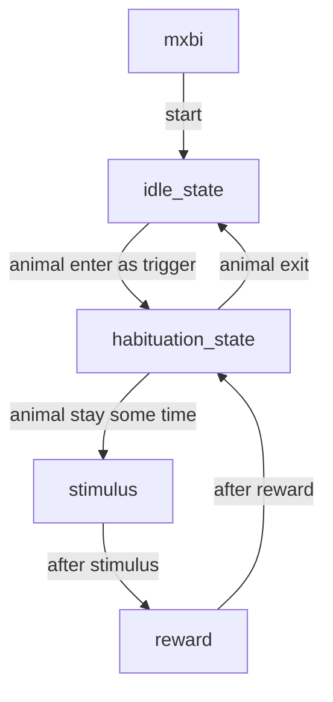

## Automated Habituation Training (Strong Auditory Cue)

**🎯 Overview**

- Familiarize the animal with the MXBI apparatus and establish the fixed relationship “auditory stimulus → reward.”
- Present a consistent routine to gradually extend stay time while keeping the reward experience stable.
- The animal must remain in MXBI for a period to obtain a reward.
- An auditory stimulus is presented before each reward to strengthen the association.

**🔁 Procedure**
The experimental flow is:



**🧭 Levels**
This stage consists of a series of levels. The parameters that change as the level increases include:

```json
"0": {
    "level": 0,
    "evaluation_interval": 20,
    "reward_interval": 5,
    "reward_duration": 1000,
    "stimulus_duration": 1000,
    "stimulus_density": 5
}
```

At level 0:

- Stay in MXBI for 5 seconds to receive a reward.
- Reward duration: 1 second; auditory stimulus duration: 1 second.
- Stimulus density: 5.
- Complete at least 20 trials to advance.

As the level increases:

- Required stay time increases; the auditory stimulus becomes longer and louder.
- More trials are required to progress, but more rewards are also available.

Outcome goal:

- Single stay in MXBI exceeds 1 minute.
- Strong understanding of “auditory stimulus → reward”.

> **Note: We currently lack detection methods; because the animal need fully controls the experiment, traditional training approaches cannot be used**

**📊 Current Level Table**

| level | evaluation_interval | reward_interval / s | reward_duration / ms | stimulus_duration / ms | stimulus_density |
| ----- | ------------------- | ------------------- | -------------------- | ---------------------- | ---------------- |
| 0     | 20                  | 5                   | 1000                 | 1000                   | 5                |
| 1     | 30                  | 10                  | 1200                 | 1500                   | 7                |
| 2     | 40                  | 15                  | 1400                 | 2000                   | 9                |
| 3     | 50                  | 20                  | 1600                 | 2500                   | 11               |
| 4     | 50                  | 25                  | 1800                 | 3000                   | 13               |
| 5     | 100                 | 30                  | 2000                 | 3000                   | 15               |
| 6     | 100                 | 35                  | 2200                 | 3000                   | 17               |
| 7     | 100                 | 40                  | 2400                 | 3000                   | 19               |
| 8     | 100                 | 45                  | 2600                 | 3000                   | 21               |
| 9     | 100                 | 50                  | 2800                 | 3000                   | 23               |
| 10    | 100                 | 55                  | 3000                 | 3000                   | 25               |
| 11    | 100                 | 60                  | 3000                 | 3000                   | 25               |

**🧪 Next Step**
Currently, the time the animal must stay in MXBI to get a reward is controlled by `reward_interval`. As shown above, it is a fixed value. Consider changing it to a range and randomly choosing the actual `reward_interval` within that range.

The complete configuration file is as follows:

```json
{
  "default": {
    "condition": {
      "config": {
        "difficulty_increase_threshold": 0.8,
        "allow_decrease": false
      }
    },
    "levels_table": {
      "0": {
        "level": 0,
        "evaluation_interval": 20,
        "reward_interval": 5,
        "reward_duration": 1000,
        "stimulus_duration": 1000,
        "stimulus_density": 5
      },
      "1": {
        "level": 1,
        "evaluation_interval": 30,
        "reward_interval": 10,
        "reward_duration": 1200,
        "stimulus_duration": 1500,
        "stimulus_density": 7
      },
      "2 ": {
        "level": 2,
        "evaluation_interval": 40,
        "reward_interval": 15,
        "reward_duration": 1400,
        "stimulus_duration": 2000,
        "stimulus_density": 9
      },
      "3": {
        "level": 3,
        "evaluation_interval": 50,
        "reward_interval": 20,
        "reward_duration": 1600,
        "stimulus_duration": 2500,
        "stimulus_density": 11
      },
      "4": {
        "level": 4,
        "evaluation_interval": 50,
        "reward_interval": 25,
        "reward_duration": 1800,
        "stimulus_duration": 3000,
        "stimulus_density": 13
      },
      "5": {
        "level": 5,
        "evaluation_interval": 100,
        "reward_interval": 30,
        "reward_duration": 2000,
        "stimulus_duration": 3000,
        "stimulus_density": 15
      },
      "6": {
        "level": 6,
        "evaluation_interval": 100,
        "reward_interval": 35,
        "reward_duration": 2200,
        "stimulus_duration": 3000,
        "stimulus_density": 17
      },
      "7": {
        "level": 7,
        "evaluation_interval": 100,
        "reward_interval": 40,
        "reward_duration": 2400,
        "stimulus_duration": 3000,
        "stimulus_density": 19
      },
      "8": {
        "level": 8,
        "evaluation_interval": 100,
        "reward_interval": 45,
        "reward_duration": 2600,
        "stimulus_duration": 3000,
        "stimulus_density": 21
      },
      "9": {
        "level": 9,
        "evaluation_interval": 100,
        "reward_interval": 50,
        "reward_duration": 2800,
        "stimulus_duration": 3000,
        "stimulus_density": 23
      },
      "10": {
        "level": 10,
        "evaluation_interval": 100,
        "reward_interval": 55,
        "reward_duration": 3000,
        "stimulus_duration": 3000,
        "stimulus_density": 25
      },
      "11": {
        "level": 11,
        "evaluation_interval": 100,
        "reward_interval": 60,
        "reward_duration": 3000,
        "stimulus_duration": 3000,
        "stimulus_density": 25
      }
    }
  }
}
```
